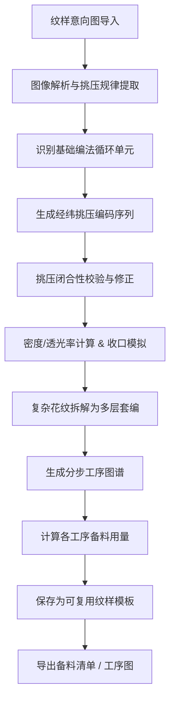

## 1. 产品概述

竹编挑压编织图谱系统是一款面向竹编非遗工坊的数字化生产力工具，通过算法解析传统竹编纹样的经纬挑压规律，将复杂的手工编织经验转化为可计算、可复用的工序图谱。

- 解决传统竹编纹样传承难、试错成本高、备料估算不准等核心痛点
- 为非遗匠人提供纹样解析、编码推演、工序拆解、备料计算、模板沉淀的全链路数字化解决方案

## 2. 核心功能

### 2.1 用户角色

| 角色 | 说明 | 核心权限 |
|------|------|----------|
| 竹编匠人 | 非遗工坊的手工艺人 | 使用全部功能，管理个人模板库 |
| 工坊管理员 | 负责工坊生产调度 | 查看团队模板、导出备料清单 |

### 2.2 功能模块

1. **纹样解析页**：导入意向图，解析经纬篾条挑压规律，识别六角孔/十字孔基础编法
2. **挑压编码页**：按目标图案反推每根篾的挑压序列，校验挑压闭合性，计算密度与透光率，模拟收口锁边
3. **分步图谱页**：复杂花纹拆解为多层套编，生成每一步操作图谱
4. **备料清单页**：按工序记录起篾根数，自动计算不同篾宽的材料用量
5. **模板库页**：存储验证过的纹样模板，支持搜索、分类、复用与导出

### 2.3 页面详情

| 页面名称 | 模块名称 | 功能描述 |
|----------|----------|----------|
| 纹样解析页 | 图像上传区 | 支持拖拽/点击上传纹样意向图，预览与缩放控制 |
| 纹样解析页 | 智能解析引擎 | 自动识别经纬方向、提取挑一压一规律矩阵、标记循环单元边界 |
| 纹样解析页 | 基础编法识别 | 识别六角孔、十字孔、人字编等基础编法的循环单元并高亮 |
| 纹样解析页 | 解析结果预览 | 以网格形式可视化展示挑/压状态，支持逐格调整修正 |
| 挑压编码页 | 目标图案编辑 | 导入或绘制目标图案，设置成品尺寸参数 |
| 挑压编码页 | 挑压序列编码 | 按经/纬方向生成每根篾的挑压序列，支持0/1二进制编码与可视化展示 |
| 挑压编码页 | 闭合性校验 | 校验挑压交错是否闭合，标记散口风险位置并给出修正建议 |
| 挑压编码页 | 密度与透光率计算 | 输入篾宽、间隙参数，实时计算成品密度、孔隙率、透光率 |
| 挑压编码页 | 收口锁边模拟 | 模拟边缘篾条收口走向，可视化展示锁边路径，预警松散风险 |
| 挑压编码页 | 配色错位预警 | 对多色篾在挑压切换处的露色错位进行检测与标记 |
| 分步图谱页 | 图层拆解 | 自动将复杂花纹拆解为多层套编结构，支持手动调整分层 |
| 分步图谱页 | 工序步骤展示 | 按编织顺序展示每一步的操作图谱，标注起篾/收篾位置 |
| 分步图谱页 | 动画演示 | 逐步骤播放编织过程动画，支持暂停、步进、回放控制 |
| 备料清单页 | 工序备料记录 | 记录每道工序的起篾根数、篾长、篾宽、颜色等参数 |
| 备料清单页 | 材料用量计算 | 自动汇总总用篾量、按规格分类统计，支持损耗系数设置 |
| 备料清单页 | 清单导出 | 导出Excel/PDF格式的备料清单，支持打印 |
| 模板库页 | 模板列表 | 网格/列表视图展示已保存纹样，支持按编法类型、难度筛选 |
| 模板库页 | 模板详情 | 查看模板完整信息：挑压矩阵、工序步骤、备料数据 |
| 模板库页 | 模板管理 | 新建、编辑、删除、分类标签、收藏标记 |
| 模板库页 | 模板导入导出 | 支持JSON格式模板文件的导入与导出共享 |

## 3. 核心流程

用户从导入纹样意向图开始，经系统解析提取挑压规律，生成编码序列后进行闭合性校验和工艺参数计算，再拆解为多层分步图谱，最终生成备料清单并存入模板库复用。

## 4. 用户界面设计

### 4.1 设计风格

- **主色调**：竹青绿色系（#5B8C5A 为主色），搭配竹篾米黄（#E8DFC7）、深棕（#3E2723），营造自然手作质感
- **辅色**：铜褐色（#8B5A2B）用于强调，朱砂红（#C0392B）用于错误预警
- **按钮风格**：圆角矩形，轻微木质纹理投影，按下有凹陷反馈
- **字体**：标题使用「霞鹜文楷」展示东方韵味，正文使用「思源宋体」保证可读性
- **布局风格**：左侧工具导航 + 中央画布工作区 + 右侧参数面板的三段式布局
- **图标风格**：线性简约图标，融入竹节、编织纹理等元素

### 4.2 页面设计概览

| 页面名称 | 模块名称 | UI 元素 |
|----------|----------|---------|
| 纹样解析页 | 图像上传区 | 虚线边框上传卡片，竹纹背景，拖拽高亮动画 |
| 纹样解析页 | 解析网格画布 | 等距网格叠加于图像之上，挑/压格以不同透明度绿色叠加显示 |
| 纹样解析页 | 编法识别面板 | 卡片式基础编法列表，选中项有竹青边框高亮 |
| 挑压编码页 | 序列编码面板 | 二进制0/1编码条，可横向滚动，挑为绿压为棕，悬停显示位置信息 |
| 挑压编码页 | 校验结果区 | 错误预警红点标记，修正建议气泡卡片 |
| 挑压编码页 | 参数计算区 | 实时数据卡片，密度/透光率以仪表盘式环形进度条展示 |
| 分步图谱页 | 图层时间轴 | 垂直时间轴展示分层，每层缩略图可展开 |
| 分步图谱页 | 工序动画区 | 中央大图区，篾条以SVG路径动画逐根出现 |
| 备料清单页 | 清单表格 | 带分组的表格，合计行高亮显示 |
| 模板库页 | 模板卡片 | 方形卡片展示纹样缩略图，悬停放大效果，标签以竹青胶囊显示 |

### 4.3 响应式

桌面端优先设计，主画布区自适应缩放。移动端将右侧参数面板折叠为底部抽屉，工具导航转为底部 Tab 栏。

### 4.4 动效设计

- 页面加载：各卡片从下至上错落淡入，间隔80ms
- 编织动画：篾条以SVG stroke-dashoffset实现穿引路径动画，挑压处有轻微明暗变化
- 悬停交互：网格单元悬停时微微上浮并显示十字参考线
- 校验反馈：错误标记以脉冲光晕循环动画吸引注意
