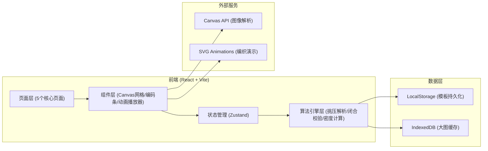
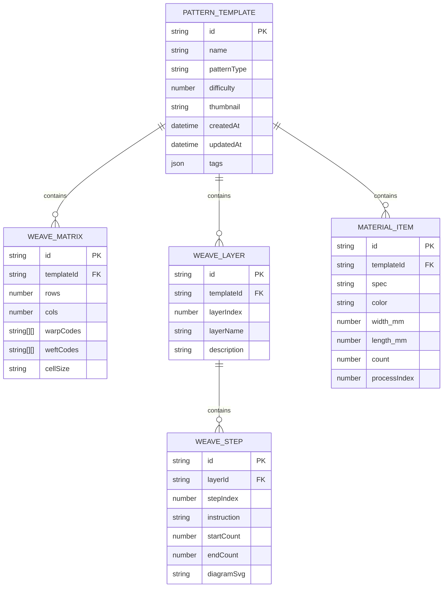

## 1. 架构设计



## 2. 技术说明

- **前端框架**：React@18 + TypeScript + Vite@6
- **样式方案**：TailwindCSS@3 + CSS Variables（竹编主题色系统）
- **状态管理**：Zustand (轻量级 store 管理纹样数据、工序数据、模板数据)
- **图像处理**：HTML5 Canvas API（像素级解析纹样图、挑压规律提取）
- **可视化渲染**：SVG + CSS Animations（篾条编织路径动画）
- **数据持久化**：LocalStorage（模板数据） + IndexedDB（大图像缓存）
- **后端**：无（纯前端工具，数据均本地存储）
- **图标库**：Lucide React（线性图标风格，配合竹编主题）

## 3. 路由定义

| 路由 | 页面 | 说明 |
|------|------|------|
| / | 纹样解析页 | 默认首页，图像导入与挑压规律解析 |
| /coding | 挑压编码页 | 序列编码、闭合校验、工艺参数计算 |
| /steps | 分步图谱页 | 图层拆解与工序动画演示 |
| /materials | 备料清单页 | 备料记录与用量统计导出 |
| /templates | 模板库页 | 纹样模板管理与复用 |

## 4. 核心数据模型

### 4.1 数据模型定义



### 4.2 TypeScript 核心类型定义

```typescript
// 挑压单元：0=压, 1=挑
type WeaveCell = 0 | 1;

// 编法类型
type PatternType = 'hexagon' | 'cross' | 'herringbone' | 'plain' | 'custom';

// 纹样模板
interface PatternTemplate {
  id: string;
  name: string;
  patternType: PatternType;
  difficulty: 1 | 2 | 3 | 4 | 5;
  thumbnail: string; // base64 or url
  tags: string[];
  description: string;
  weaveMatrix: WeaveMatrix;
  layers: WeaveLayer[];
  materials: MaterialItem[];
  params: WeaveParams;
  createdAt: number;
  updatedAt: number;
}

// 挑压矩阵
interface WeaveMatrix {
  rows: number;
  cols: number;
  cellSize: number; // mm
  warpCodes: WeaveCell[][];   // 经篾编码（每根经篾对应一行）
  weftCodes: WeaveCell[][];   // 纬篾编码（每根纬篾对应一行）
  detectedPatterns: DetectedPattern[];
}

// 识别到的基础编法循环单元
interface DetectedPattern {
  type: PatternType;
  startRow: number;
  startCol: number;
  width: number;
  height: number;
}

// 工艺参数
interface WeaveParams {
  bambooWidth: number;  // 篾宽 mm
  bambooGap: number;    // 间隙 mm
  finishedWidth: number;
  finishedHeight: number;
  lossRate: number;     // 损耗系数
}

// 套编图层
interface WeaveLayer {
  id: string;
  layerIndex: number;
  layerName: string;
  description: string;
  steps: WeaveStep[];
}

// 工序步骤
interface WeaveStep {
  id: string;
  stepIndex: number;
  instruction: string;
  startCount: number;
  endCount: number;
  diagramSvg?: string;
}

// 备料项
interface MaterialItem {
  id: string;
  spec: string;
  color: string;
  widthMm: number;
  lengthMm: number;
  count: number;
  processIndex: number;
}

// 校验结果
interface ValidationResult {
  isValid: boolean;
  errors: ValidationError[];
  warnings: ValidationWarning[];
}

interface ValidationError {
  type: 'open_end' | 'misalignment' | 'color_shift';
  row?: number;
  col?: number;
  message: string;
  suggestion?: string;
}
```

## 5. 核心算法模块说明

### 5.1 纹样解析算法
- 输入：用户上传的意向图
- 处理：Canvas 像素采样 → 灰度化 → 二值化 → 网格划分 → 按格判断挑/压状态
- 输出：`WeaveMatrix` 挑压矩阵

### 5.2 编法识别算法
- 在挑压矩阵上滑窗匹配预定义模式：
  - 十字孔：2×2 交替棋盘格
  - 六角孔：3×3 蜂窝状挑压分布
  - 人字编：阶梯状挑压序列
- 输出连续匹配区域的循环单元边界

### 5.3 闭合性校验算法
- 遍历矩阵边缘行/列，检查挑压序列首尾是否可衔接形成循环
- 检测是否存在「连续同态超过阈值」的散口风险区域
- 标记位置并给出翻转建议

### 5.4 密度与透光率计算
```
密度 (根/10cm) = 100 / (篾宽 + 间隙)
孔隙率 = (间隙^2) / ((篾宽 + 间隙)^2)
透光率 ≈ 孔隙率 × 透光系数(经验值0.85)
```

### 5.5 套编分层算法
- 基于挑压频率与颜色分组自动划分图层
- 按「起篾→主纹→收篾」的工艺逻辑排序步骤
